# AI Interview Trainer Agent

An AI-powered multi-agent interview preparation platform built using IBM watsonx Orchestrate and Retrieval-Augmented Generation (RAG).

The system analyzes resumes, retrieves role-specific interview content, conducts mock interviews, evaluates candidate responses, and generates personalized readiness reports to help candidates succeed in competitive hiring environments.
---

# Project Overview

The AI Interview Trainer Agent acts as a centralized interview preparation assistant.

The platform can:

* Analyze resumes
* Identify skills and experience
* Recommend suitable job roles
* Conduct interview preparation sessions
* Generate technical questions
* Conduct HR interview preparation
* Evaluate candidate answers
* Generate improvement suggestions
* Conduct mock interviews
* Generate final interview readiness reports

---

# Challenge Overview

## Problem Statement

The challenge is to build an **AI-powered Interview Trainer Agent** using IBM watsonx Orchestrate and Retrieval-Augmented Generation (RAG) techniques.

The Interview Trainer Agent helps users prepare effectively for job interviews by generating personalized interview preparation content based on their:

* Resume
* Job Role
* Skills
* Experience Level
* Career Goals

The system retrieves role-specific interview questions, industry expectations, behavioral scenarios, HR guidelines, and technical concepts from curated knowledge sources and interview datasets.

Users can upload their resume or specify a target job role, and the agent provides:

* Personalized interview preparation plans
* Technical interview questions
* HR and behavioral interview questions
* Model answers
* Interview strategies
* Improvement recommendations
* Mock interview assessments
* Final readiness reports

The solution supports both technical and soft-skill evaluation, ensuring a comprehensive interview preparation experience.

By leveraging AI-driven coaching, resume analysis, retrieval-augmented knowledge, and structured feedback mechanisms, the Interview Trainer Agent helps candidates:

* Improve interview confidence
* Strengthen technical knowledge
* Enhance communication skills
* Identify weak areas
* Practice realistic interview scenarios
* Increase success rates in competitive hiring environments

---

## Our Solution

To address this challenge, we developed a **Multi-Agent AI Interview Trainer Platform** using IBM watsonx Orchestrate.

The platform consists of:

* Interview Trainer Agent (Central Coordinator)
* Resume Analyzer Agent
* Technical Interview RAG Agent
* Question Generator Agent
* HR Coach Agent
* Soft Skills Coach Agent
* Answer Evaluation Agent
* Feedback Agent

The system performs:

1. Resume Analysis
2. Candidate Skill Extraction
3. Personalized Interview Preparation
4. Technical Interview Coaching
5. HR & Behavioral Coaching
6. Mock Interview Sessions
7. Answer Evaluation
8. Final Interview Readiness Assessment

This architecture enables an end-to-end interview preparation experience tailored to each candidate's profile and career goals.

---

# Key Contributions

This project introduces a multi-agent interview preparation ecosystem powered by IBM watsonx Orchestrate and Retrieval-Augmented Generation (RAG).

Key contributions include:

- Resume-based interview preparation
- Multi-agent orchestration for specialized interview coaching
- Technical interview preparation using RAG
- HR and behavioral interview coaching
- Communication and soft skills development
- Automated mock interview assessment
- Personalized interview readiness evaluation
- Knowledge-driven interview question retrieval

---

## System Architecture

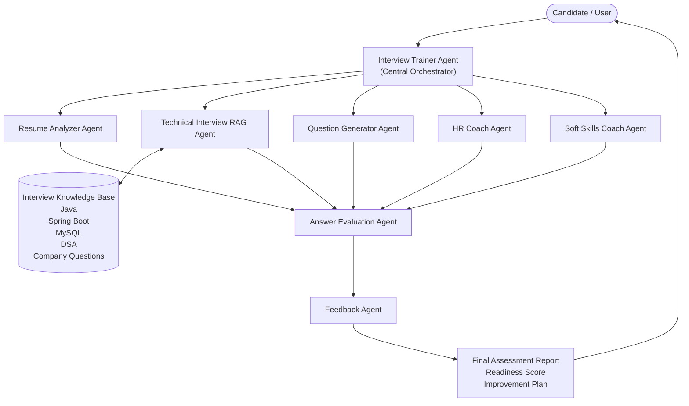

---

## Multi-Agent Responsibilities

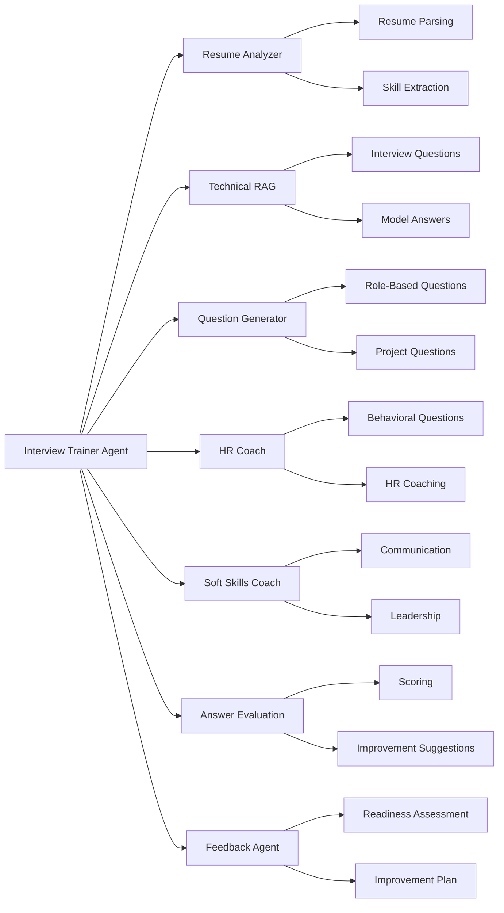

---

## Knowledge Base Architecture

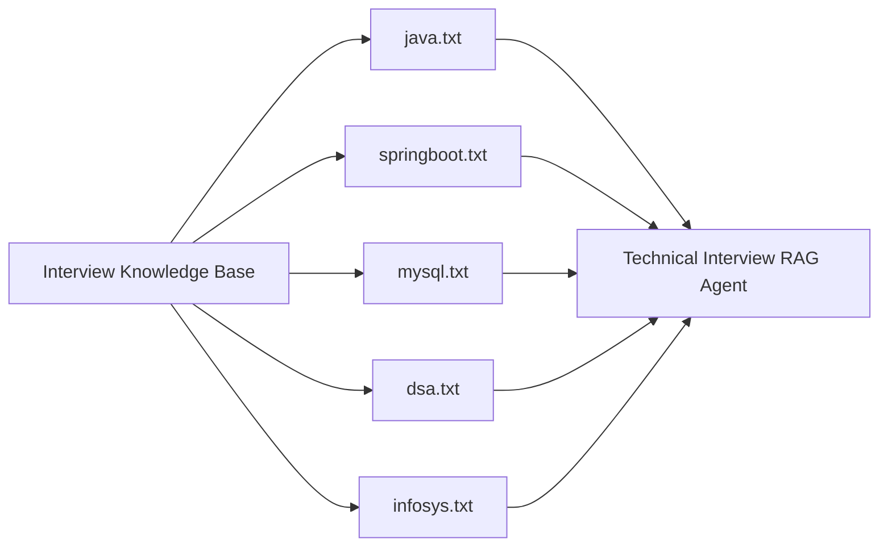

---

## Workflow Architecture

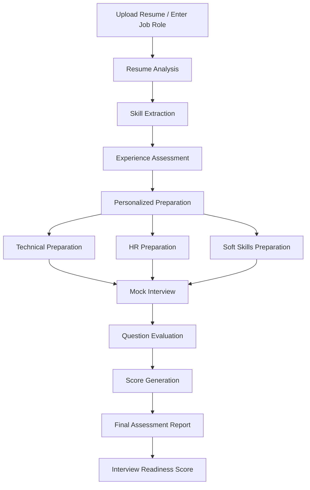

---

# Agents Used

## 1. Interview Trainer Agent

Acts as the central coordinator.

Responsibilities:

* Resume understanding
* Interview preparation
* Mock interviews
* Candidate guidance
* Agent orchestration

---

## 2. Resume Analyzer Agent

Responsibilities:

* Resume parsing
* Skill extraction
* Project analysis
* Experience evaluation
* Role recommendations

Outputs:

* Skills summary
* Experience level
* Strengths
* Improvement areas

---

## 3. Technical Interview RAG Agent

Responsibilities:

* Retrieve technical interview questions
* Retrieve model answers
* Retrieve key concepts
* Retrieve common mistakes
* Retrieve company-specific questions

Knowledge Sources:

* Java
* Spring Boot
* MySQL
* DSA
* Infosys Interview Questions

---

## 4. Question Generator Agent

Responsibilities:

* Generate role-specific questions
* Generate project-based questions
* Generate custom interview questions
* Generate fallback questions

---

## 5. HR Coach Agent

Responsibilities:

* HR interview preparation
* Behavioral interview preparation
* Salary discussion preparation
* Career goal coaching

---

## 6. Soft Skills Coach Agent

Responsibilities:

* Communication skills
* Leadership coaching
* Teamwork preparation
* Group discussion preparation
* Confidence building

---

## 7. Answer Evaluation Agent

Responsibilities:

* Evaluate candidate answers
* Score responses
* Identify missing concepts
* Suggest improvements

Scoring Scale:

0 - 10

---

## 8. Feedback Agent

Responsibilities:

* Generate final reports
* Readiness assessment
* Improvement plans
* Strength and weakness analysis

---

# Features

## Resume Analysis

* Resume upload
* Skill extraction
* Project analysis
* Education extraction
* Experience analysis

---

## Technical Preparation

* Java preparation
* Spring Boot preparation
* MySQL preparation
* DSA preparation
* Company-specific preparation

---

## HR Preparation

* Tell me about yourself
* Strengths and weaknesses
* Why should we hire you
* Career goals
* Salary expectations

---

## Mock Interviews

* 5-question interview flow
* One question at a time
* Real-time evaluation
* Score generation

---

## Answer Evaluation

For every answer:

* Score
* Strengths
* Weaknesses
* Missing Concepts
* Improvement Suggestions

---

## Final Assessment

Generates:

* Overall Score
* Technical Assessment
* Communication Assessment
* Readiness Level
* Improvement Plan

---

# Sample Use Cases

### Resume Analysis

Upload a resume and receive:

* Skills summary
* Projects summary
* Experience analysis
* Recommended job roles

---

### Interview Preparation

Ask:

"Prepare me for Java Developer Interview"

The agent provides:

* Important topics
* Frequently asked questions
* Model answers
* Interview tips

---

### Mock Interview

Ask:

"Start a mock interview"

The agent:

* Conducts 5 questions
* Evaluates each answer
* Generates final assessment

---

# Challenge Alignment

This solution directly addresses the challenge requirements by:

✅ Resume-Based Preparation

✅ Role-Based Interview Preparation

✅ Technical Interview Question Retrieval

✅ HR & Behavioral Interview Coaching

✅ Soft Skills Development

✅ Retrieval-Augmented Generation (RAG)

✅ Mock Interview Assessments

✅ Answer Evaluation & Scoring

✅ Personalized Improvement Suggestions

✅ Final Readiness Assessment

---

# Screenshots

## 1. Agent Dashboard

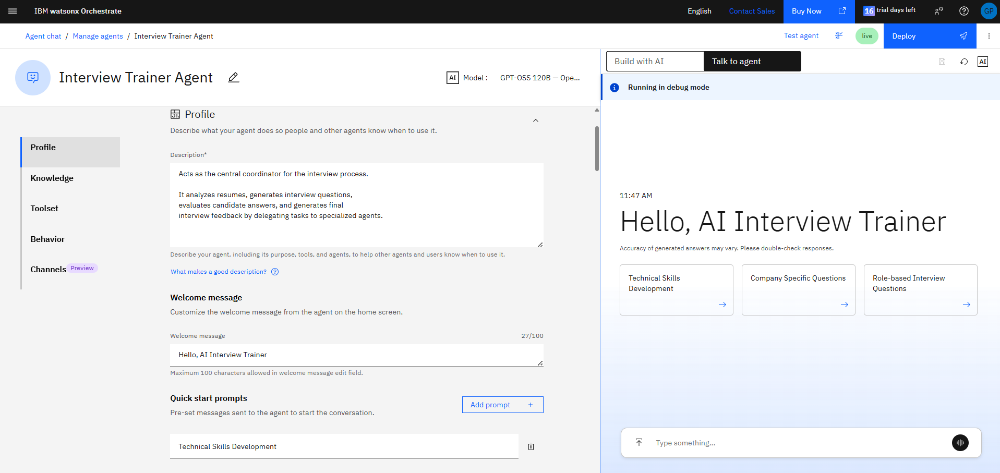

---

## 2. Multi-Agent Architecture

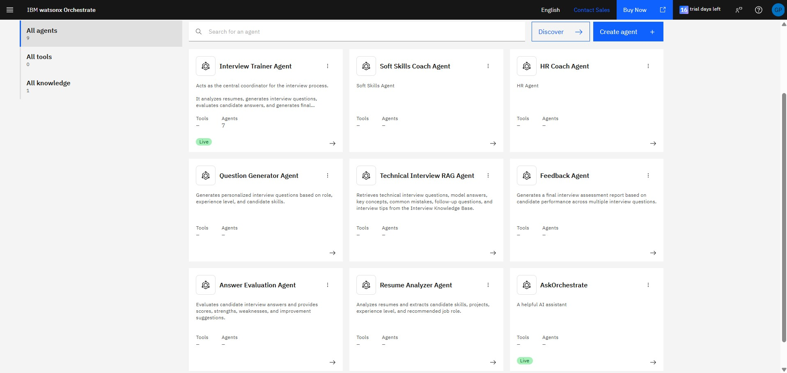

---

## 3. Resume Analysis

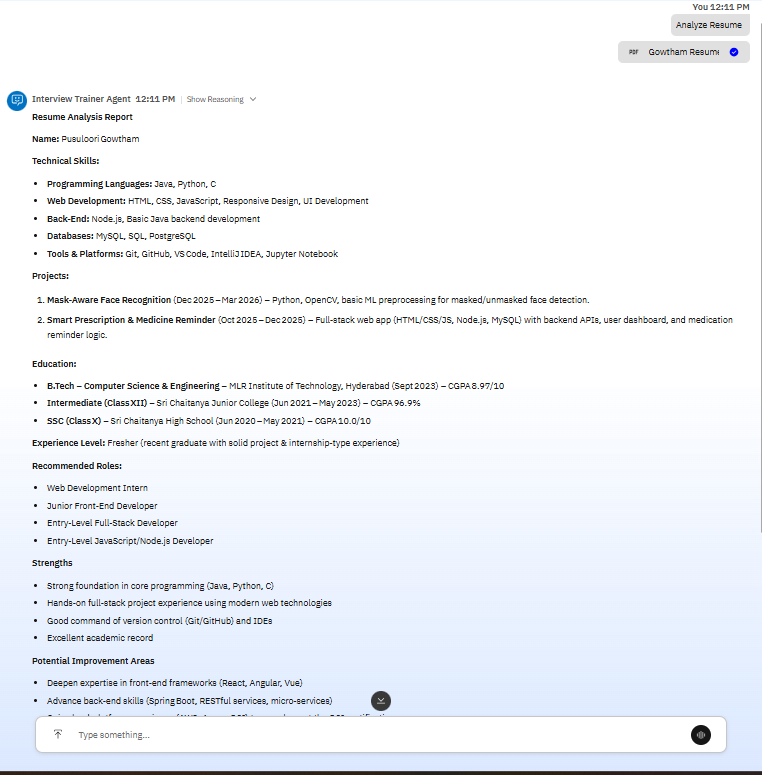

---

## 4. Technical Interview Preparation

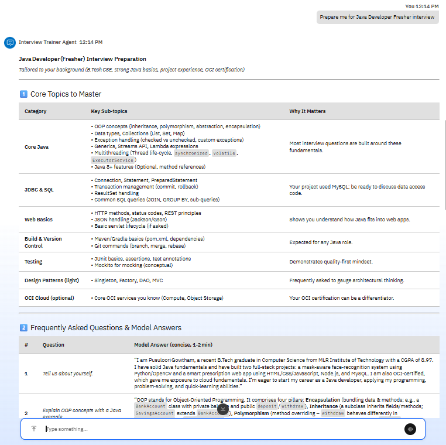

---

## 5. Mock Interview Session

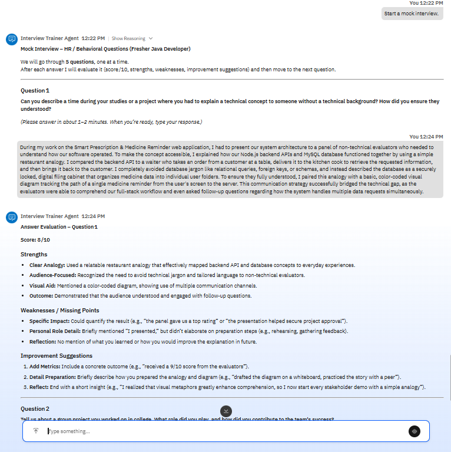

---

## 6. Final Assessment Report

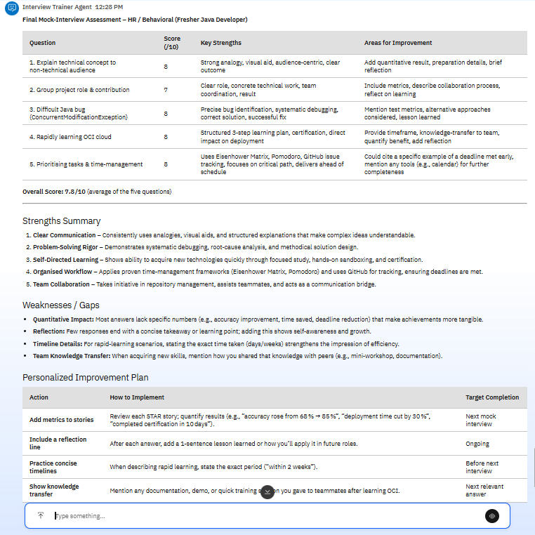

---

## 7. Knowledge Base

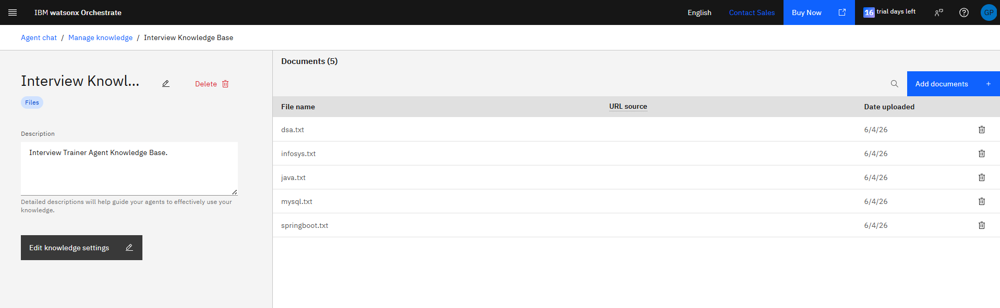

---

# Demonstrated Capabilities

The system successfully demonstrates:

- Resume Analysis
- Skill Extraction
- Experience Assessment
- Technical Interview Preparation
- HR Interview Preparation
- Behavioral Interview Coaching
- Communication Skills Coaching
- Mock Interview Execution
- Answer Evaluation
- Readiness Assessment
- Knowledge Retrieval using RAG

---

# Technology Stack

## AI Platform

* IBM watsonx Orchestrate
* IBM watsonx Services

## Model

* GPT-OSS 120B

## Knowledge Base

* TXT Documents
* Retrieval-Augmented Generation (RAG)

## Agents

* Interview Trainer Agent
* Resume Analyzer Agent
* Technical Interview RAG Agent
* Question Generator Agent
* HR Coach Agent
* Soft Skills Coach Agent
* Answer Evaluation Agent
* Feedback Agent

---

# Repository Structure

```text
AI-Interview-Agent/
│
├── README.md
│
├── screenshots/
│   ├── 01_Multiple_Agents.jpg
│   ├── 02_Interview_Trainer_Agent.png
│   ├── 03_Interview_Trainer_Toolset.png
│   ├── 04_Resume_Analysis.png
│   ├── 05_Technical_Preparation.png
│   ├── 06_HR_Preparation.png
│   ├── 07_Mock_Interview.png
│   ├── 08_Answer_Evaluation.png
│   ├── 09_Final_Assessment_Report.png
│   └── 10_RAG_Knowledge_Base.png
│   ├── 11_Voice_Feature.mp4
│   ├── 12_Speech_to_Text_Conversion.png
│
├── knowledge-base/
│   ├── java.txt
│   ├── springboot.txt
│   ├── mysql.txt
│   ├── dsa.txt
│   └── infosys.txt
│
└── documentations/
    ├── Agent_Design.md
    ├── Architecture.md
    ├── Knowledge_Base_Design.md
    ├── Setup_Guide.md
    └── Testing_Report.md
```
---

# Outcomes

Successfully implemented:

✅ Resume Analysis

✅ Technical Interview Preparation

✅ HR Interview Preparation

✅ Soft Skills Coaching

✅ Mock Interview Workflow

✅ Answer Evaluation

✅ Final Assessment Report

✅ Multi-Agent Architecture

✅ Knowledge Base Integration

✅ Voice-Based Interviews


---

# Business Impact

The AI Interview Trainer Agent helps:

- Students preparing for campus placements
- Fresh graduates preparing for technical interviews
- Professionals preparing for job transitions
- Candidates improving communication skills
- Organizations providing interview readiness training

The platform delivers structured, personalized, and scalable interview coaching, helping candidates improve confidence and increase success rates in competitive hiring environments.

---

# Future Enhancements

* Video interview simulation
* Frontend web application
* Candidate dashboard
* Progress tracking
* Interview history
* Company-wise interview datasets
* Resume-job matching

---

# Author

**Pusuloori Gowtham**

Bachelor of Technology (B.Tech)
Computer Science & Engineering

Project:
AI Interview Trainer Agent using IBM watsonx Orchestrate and Retrieval-Augmented Generation (RAG)
