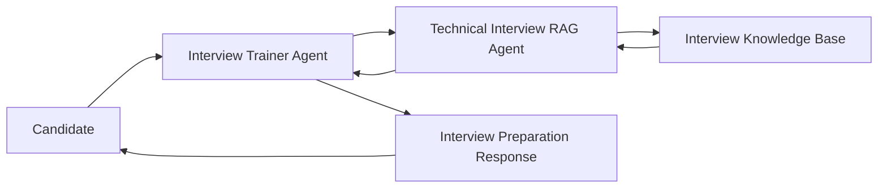
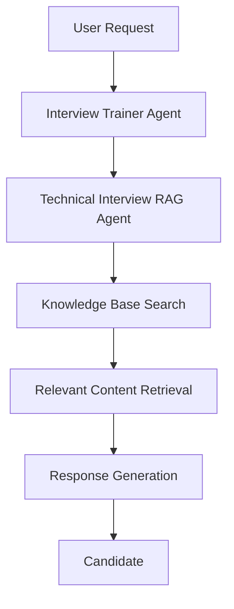
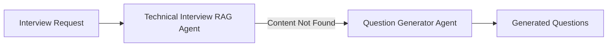

# Knowledge Base Design Document

# AI Interview Trainer Agent

## Overview

The AI Interview Trainer Agent uses a Retrieval-Augmented Generation (RAG) architecture to provide accurate, role-specific, and skill-based interview preparation.

The knowledge base serves as the primary source of technical interview content and contains structured interview preparation material for multiple technologies and job roles.

Instead of relying solely on the foundation model, the Technical Interview RAG Agent retrieves relevant information from the knowledge base and uses it to generate interview preparation guidance.

---

# Purpose of the Knowledge Base

The knowledge base enables the system to:

* Retrieve technical interview questions
* Retrieve model answers
* Retrieve key concepts
* Retrieve interview tips
* Retrieve common mistakes
* Retrieve company-specific interview questions
* Generate personalized preparation plans

This improves:

* Accuracy
* Consistency
* Domain relevance
* Interview readiness

---

# RAG Architecture



---

# Knowledge Base Structure

The knowledge base consists of multiple TXT files.

Each file contains interview preparation content for a specific technology, role, or company.

Example Structure:

```text
knowledge-base/
│
├── java.txt
├── springboot.txt
├── mysql.txt
├── dsa.txt
├── infosys.txt
└── hr_questions.txt
```

---

# Knowledge Categories

## Technical Knowledge

Contains:

* Core Concepts
* Interview Questions
* Expected Answers
* Key Concepts
* Common Mistakes
* Interview Tips

Examples:

* Java
* Spring Boot
* MySQL
* DSA

---

## Company-Specific Knowledge

Contains:

* Company Interview Patterns
* Frequently Asked Questions
* Interview Experiences
* Hiring Expectations

Examples:

* Infosys
* TCS
* Wipro
* Accenture

---

## HR Knowledge

Contains:

* HR Questions
* Behavioral Questions
* Career Guidance
* Salary Discussions

---

# Knowledge Base Format

Each technical question follows a structured format.

Example:

```text
Role: Java Developer

Question:
What is JVM?

Expected Answer:
JVM stands for Java Virtual Machine.
It executes Java bytecode and provides platform independence.

Difficulty:
Easy

Skill:
Java

Experience:
Fresher
```

---

# Benefits of Structured Format

The structured format improves retrieval quality by allowing the RAG Agent to identify:

* Role
* Skill
* Difficulty
* Experience Level
* Question
* Answer

This enables more precise interview preparation.

---

# Retrieval Process



---

# Knowledge Retrieval Workflow

Step 1:
User requests interview preparation.

Example:

```text
Prepare me for Java Developer Interview.
```

---

Step 2:
Interview Trainer Agent identifies:

* Skill = Java
* Role = Java Developer
* Experience = Fresher

---

Step 3:
Technical Interview RAG Agent searches the knowledge base.

Example:

```text
java.txt
```

---

Step 4:
Relevant interview content is retrieved.

Retrieved Information:

* Questions
* Answers
* Key Concepts
* Common Mistakes
* Interview Tips

---

Step 5:
Interview preparation response is generated.

---

# Question Generation Fallback

When the required content is not available in the knowledge base:



The Question Generator Agent creates:

* Additional Questions
* Project-Based Questions
* Scenario-Based Questions
* Role-Specific Questions

---

# Knowledge Base Design Principles

The knowledge base was designed using the following principles:

### Accuracy

Interview questions are based on industry-standard concepts.

### Consistency

All content follows the same structured format.

### Scalability

New technologies can be added easily.

Example:

```text
python.txt
aws.txt
react.txt
docker.txt
```

### Reusability

The same knowledge base can support:

* Preparation
* Mock Interviews
* Answer Evaluation

---

# Current Knowledge Sources

The current implementation contains:

| File             | Purpose                           |
| ---------------- | --------------------------------- |
| java.txt         | Java Interview Preparation        |
| springboot.txt   | Spring Boot Interview Preparation |
| mysql.txt        | MySQL Interview Preparation       |
| dsa.txt          | Data Structures & Algorithms      |
| infosys.txt      | Company-Specific Questions        |

---

# Future Knowledge Base Expansion

Planned additions:

* Python
* AWS
* Azure
* Docker
* Kubernetes
* React
* Angular
* Microservices
* System Design
* Data Engineering

---

# Advantages of RAG-Based Design

Compared to a traditional chatbot:

### Traditional Chatbot

* Relies only on model knowledge
* Less consistent
* Limited customization

### RAG-Based Interview Trainer

* Uses curated interview content
* Provides accurate answers
* Supports company-specific preparation
* Supports role-specific preparation
* Easy to update

---

# Conclusion

The Knowledge Base is the foundation of the AI Interview Trainer Agent.

By combining structured interview content with Retrieval-Augmented Generation (RAG), the system delivers accurate, personalized, and scalable interview preparation experiences for technical, HR, and company-specific interview scenarios.
